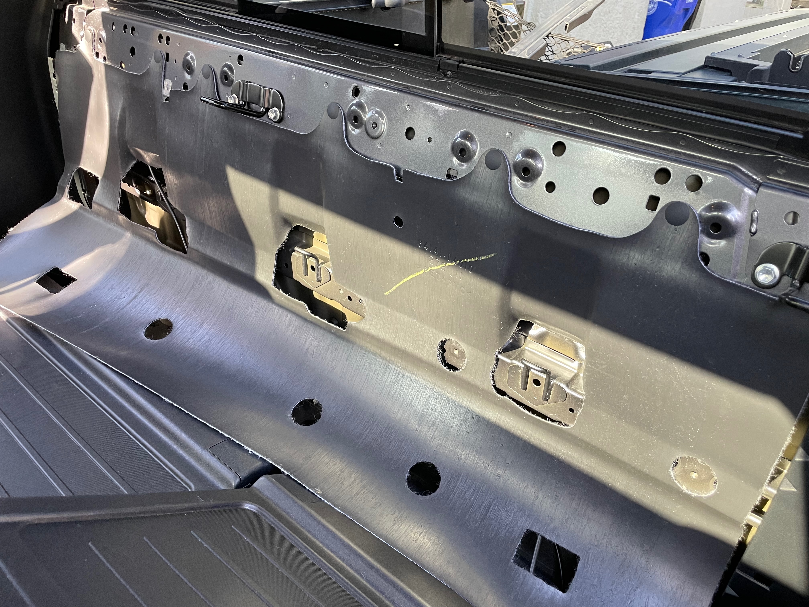

# Introduction
This is a quick explanation for how to install a HAM (or CB) radio antenna on a 2017 Toyota Tacoma. I originally had my HAM radio antenna installed on a lip mount on the driver side door (see [CP-5M Comet Universal RS-730 Lip Mount](https://www.amazon.com/dp/B0DF981DRJ)). I decided to move it to the back of the vehicle to reduce the radiation exposure inside the cab. My radio puts out 40 watts on the 2 m band.

TODO pic of completed installation

# Supplies
* Toyota [antenna tailgate mount](https://www.amazon.com/dp/B0CQSXMWGP/ref=pe_386300_440135490_TE_simp_item_imag)
* Antenna for your application. I'm using TODO [Comet XXX]() for my HAM radio, which works on the 2 m and 70 cm bands.
* Antenna mount and cable. I'm using the NMO mount and attached cable that came with the Coment lip mount listed above, since that's what I had already.
* A couple 6mm x 1.0 x 20mm bolts
* A homemade ground strap

# Steps
First off, the routing of this cable requires that you don't have a plug on one end of your coax. The UHF plug (PL-259) on the Comet lip mount unscrews, so I just removed the connector in order to thread the cable through the truck. If you're starting with coax cable that has no connectors, that will also work, of course.

TODO PIC of Comet connector

The cable will be routed behind the rear brake light assembly, through the upper frame of the truck bed, into the rear cab vent, behind the rear seat storage compartments, and then under the rear cargo mat to my radio body, which is located under the driver side seat. Note that I put the antenna on the passenger side of the tailgate. My truck's bed step is on the driver side, and that's the side I use to climb into the bed. So I didn't want an antenna there.

## Step 1 - Remove the read tail light assembly.
Unscrew the two 10 mm bolts circled in the picture. Go slow with this. My trunk has 100,000 miles on it, and the bottom bolt ended up snapping the plastic that was holding the retainer on the tail light assembly. Boo! (I epoxied it back together.) So, unscrew cautiously with a socket wrench and not an impact driver. When the bolts are out, pull the top of the tail light towards you, and then pull the bottom away from the truck. These are just pressed in retainers.

TODO PIC of tail light removal

## Step 2 - Install the antenna mounting bracket.

The mounts I purchased attach to the two frame bolts shown in the picture. I had to bend them slightly so that they would clear the tailgate when it opens and closes, but otherwise they are an excellent fit.

As you can see in the picture, the second fastener isn't a bolt anymore. That's because I broke the head off of that bolt getting it out. I had to drill it out, and all I had on hand was a 6 mm allen head screw. I suggest you soak those bolts in WD-40 before you try to unscrew them. You will also need to drill out the hole in the antenna mounting bracket to fit the diameter of your antenna mount.

TODO pic of drilled out mount

## Step 3 - Route the cable through the upper frame of the truck bed.

This is the trickiest part. First, you need to remove the Tonneau Cover if you have one of those. Next, you'll need to remove the plastic trim on the top of the bed. This just pulls straight up, since it's held in place with clip fasteners. This will expose the channel where the cable is going to go.

TODO PIC of trim removed

Next, you may have to drill out the small hole that goes into the bed channel. If you look up into the tail light cavity, you'll see a small hole. I drilled this out slightly larger so it would accommodate the plug on my coax, but if you're running coax with no connectors, you won't need to make the hole bigger. I also put a rubber gromment on this hole, just to protect the coax a bit more. Here's a picture of the coax running through the hole.

On the other end of the channel, pull out the little rubber plug shown in the picture below. This will give you access to the other end of the channel, and your cable is going to come out here.

To run the cable through the channel, I just used some needle nose pliers to hold the cable in place while I snaked it through the channel. I wanted it to sit on the top of the channel rather than fall into the bed side walls. It took a few tries to make this happen.

## Step 4 - Remove the storage compartments from behind the rear seats.

Tilt both rear seats down, remove the head rests, and tilt both rear seat backs all the way flat. Unscrew the 6 bolts in the rear storage compartments. Then the trim away, starting at the top. Once again, the trim is held in place by retainer clips. This will expose the rear wall of the cable. The vents are underneat that insulation flap.

TODO PIC of the trim to remove

## Step 5 - Route the cable into the rear cab vent and along the back wall of the cab.

As you can see from the pictures, the cable goes into the vent and then along the back wall of the cab. It then comes out under the rear seat, goes under the rubber floor mat, and under the driver's side seat.

TODO PIC of full cable routing

TODO PIC of cable rounting under the seat

## Step 6 - Ground strap.

The mounts I purchased are powder coated and thus have no exposed metal to provide a good frame ground. To fix this, I made a ground strap wire that screws in the base of the NMO mount and then attaches to one of the bolts on the antenna mount bracket. I also replaced the factory bolt with an uncoated 6mm bolt. This ensured conductivity with the ground strap and the bolt.

TODO PIC of ground strap

TODO PIC of the ground strap screwed to the bracket

## Step 7 - Test!

Please do this before you put everything back together. 

1. With your UHF connector disconnected from the radio, check continuity of the cable from the UHF connector to the antenna mount. Check both the center conductor and the shield!
2. With your UHF connector disconnected from the radio, check continuity of the shield on the antenna mount to your truck frame. You'll probably see a few ohms, but it shouldn't be anything higher than that.
3. With the antenna mounted, measure SWR with a VNA. This allows you to find any massive issues before sending a bunch of power down the cable.
4. With the antenna mounted, measure SWR with an SWR meter. You can do a quick tuning now, but mostly you're just looking for major problems.

I've had a coax failure before, so those continuity tests are really important. And if you don't have a solid frame ground, you need to fix that before doing an SWR test. 

  

## Step 8 - Reinstall the trim.

Put the rear seat storage trim back in place. Reinstall the bed trip and the bed cover. Reinstall the tail light.

It's a good idea to measure SWR again and do a fine tuning. You're supposed to do SWR tuning in "real world conditions." But let's face it, the performance is going to vary a bit if your truck bed it full of a bunch of metal objects vs. being empty. Just get it below 1:2.0 across your operating bands.

